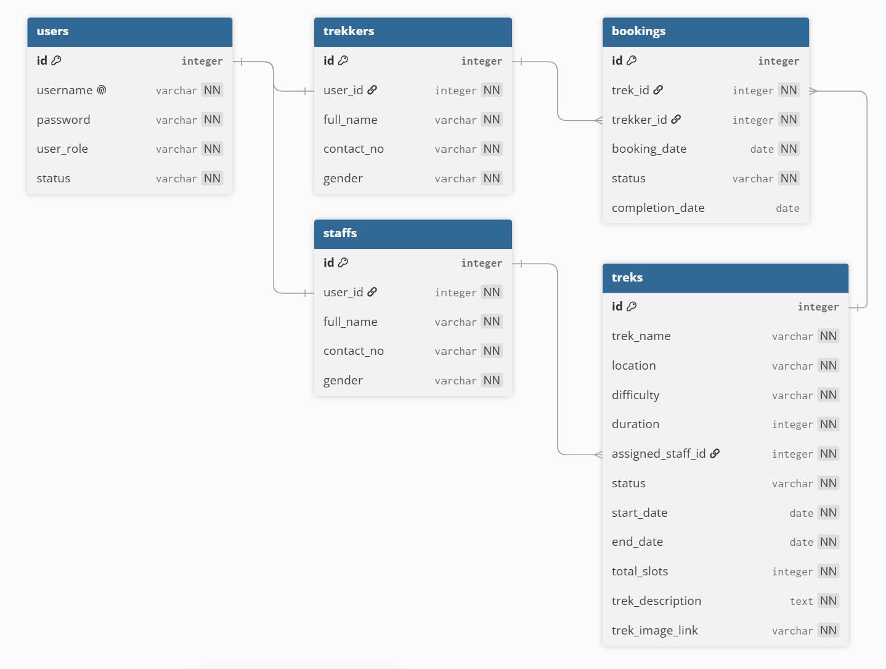

# TMA | Trekking Management Application
An academic project for the course **CS2003P (Modern Application Development I Project)** of **BS in Data Science and Applications** program under the **Indian Institute of Technology Madras**

## Problem Statement

To design and build a web-based application that allows admin, staff, and trekkers to manage, track, and coordinate trekking activities efficiently. The application eliminates the need for manual spreadsheets and prevents communication gaps by providing a centralized workflow for trekking activities, including real-time booking tracking and overbooking prevention.

### Approach

The application was built using Python and Flask as the backend framework utilizing SQLite and modular MVC architecture. To effectively coordinate activities, the system implements a 
role-based access control system tailored to three specific user types:

  

- **Admin:** Functions as the pre-existing superuser who oversees the platform. Admin manages all trek listings, approves or blacklists accounts, and assigns specific staff members to lead treks.
- **Trek Staffs:** Act as the trekking guides. Upon receiving admin approval, staff can access their dashboard to view assigned treks, update slot availability or trek status, and monitor their registered participants.
- **Trekkers (Users):** Can register to browse and filter treks by difficulty and location. Trekkers can book treks, monitor their booking status, and view their personal trekking history.

## Technologies and Frameworks Used
- **Flask:** Core backend web framework for application logic and routing.
- **SQLAlchemy:** Object-Relational Mapper (ORM) for managing SQLite database interactions.
- **Jinja2:** Template engine for rendering dynamic HTML pages.
- **Bootstrap 5.3.8:** Frontend framework for styling and UI design.
- **Bootstrap Icons 1.13.1:** Vector icon library (accessed via CDN) for UI elements.
- **SQLite:** Lightweight relational database for local data storage

**Media Attribution:**

In addition to the development frameworks listed above, external placeholder vector assets (Male Profile Image and Female Profile Image, downloaded from Vecteezy.com) were integrated into the frontend interface.

## Database Schema & ER Diagram
**Models (Tables):**
1. **User (`users`)**: Stores core authentication details and system roles (`id`, `username`, `password`, `user_role`, `status`).
2. **Staff (`staffs`)**: An extension of the users table storing profile information for trek guides (`id`, `user_id`, `full_name`, `contact_no`, `gender`).
3. **Trekker (`trekkers`)**: An extension of the users table storing profile details for participants (`id`, `user_id`, `full_name`, `contact_no`, `gender`).
4. **Trek (`treks`)**: Contains detailed information, schedules, availability, and the assigned guide for each trek (`id`, `trek_name`, `location`, `difficulty`, `duration`, `assigned_staff_id`, `status`, `start_date`, `end_date`, `total_slots`, `trek_description`, `trek_image_link`).
5. **Booking (`bookings`)**: Acts as the transactional entity mapping trekkers to their reserved treks (`id`, `trek_id`, `trekker_id`, `booking_date`, `status`, `completion_date`).

**Relationships:**
1.	**One-to-One Extended Relations:**
    - `User` → `Staff` (A core user account extends to a specific staff profile)
    - `User` → `Trekker` (A core user account extends to a specific trekker profile)
2.	**One-to-Many Relations:**
    - `Staff` → `Trek` (One staff member can be assigned to guide multiple treks)
    - `Trekker` → `Booking` (One trekker can make multiple trek bookings over time)
    - `Trek` → `Booking` (One trek event can receive multiple bookings from different trekkers)

**ER Diagram:**

  

## Architecture and Features

**Architecture Overview:**

The application follows a structured Model-View-Controller (MVC) pattern, organized into the following key directories and files:

- `main.py` - The primary entry point for the Flask application, responsible for initializing the server and application configurations.
- `/application/models.py` - Contains the SQLAlchemy database model definitions, mapping Python classes to the relational SQLite tables.
- `/application/controllers.py` - Manages the routing logic and application behavior, processing user requests and bridging data between the database models and the frontend views.
- `/templates/` - Contains the Jinja2 HTML templates used to dynamically render responsive, role-specific web pages.
- `/static/` - Stores all static frontend assets, including custom CSS, JavaScript files, images, and local Bootstrap 5.3.8 resources.
- `/instance/tma.sqlite3` - The localized SQLite database file where all application data is securely stored.
- `requirements.txt` - Lists all necessary Python dependencies and libraries required to run the application environment.

**Implemented Features:**

1.	**Database Models and Schema Setup:** A robust relational database structure built with SQLAlchemy containing core tables for Users, Staff pros, Trekkers, Treks, and Bookings. A default Admin account is pre seeded via an automated initialization script.
2.	**Authentication and Role-Based Access:** Secure user and staff registration. An Admin approval required for activating staff’s account. Strict role-based access control to isolate dedicated dashboards.
3.	**Admin Dashboard and Management:** A comprehensive superuser panel providing global system statistics, full CRUD capabilities for treks, staff assignment workflows, account blacklisting, and search functionality by name or ID.
4.	**Trek Staff Dashboard and Trek Management:** An isolated, role-restricted dashboard allowing approved staff to view their assigned trips, monitor live participant counts, adjust slot availability, and update active trek statuses.
5.	**Trekker Dashboard and Trek Booking System:** An isolated interface for trekkers to manage their profiles, browse treks using difficulty and location filters, and request trek bookings.
6.	**Trek Booking History and Trek Status Tracking:** A centralized validation and tracking layer that maintains separate lifecycles for treks (Open, Closed, Started, Completed) and bookings (Booked, Started, Completed). It prevents overbooking beyond available slots, blocks duplicate registrations, and enforces role-based data access across all history records.

## Author
**Engr Md Jahangir Alam**  
*BS in Data Science and Applications* program  
*Indian Institute of Technology Madras*
